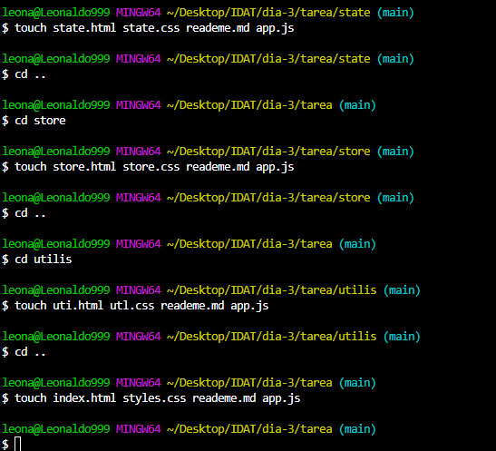

# [](https://git.io/typing-svg)

## Historial navegable

- [Reconocimiento de entorno de trabajo](#reconocimiento-de-entorno-de-trabajo)
- [Instalacion de VScode](#instalacion-de-vscode)
- [Playing Emmet](#playing-emmet)
- [Inspeccion de paginas web](#inspeccion-de-paginas-web)
- [Instalacion de gitbush](#instalacion-de-gitbush)
- [Creacion de carpetas desde gitbush](#creacion-de-carpetas-desde-gitbush)
- [Creacion de Archivos desde gitbush](#creacion-de-archivos-desde-gitbush)
- [Consejos en vsStudio Code](#consejos-en-vsstudio-code)
- [Comandos Linux](#comandos-linux)
- [Captura de patalla](#captura-de-patalla)

## Reconocimiento de entorno de trabajo

El reconocimiento del entorno de trabajo en el frontend implica familiarizarse con las herramientas y tecnologías que se utilizan para el desarrollo de aplicaciones y sitios web.

### Aquí hay algunos aspectos claves

- **Editor de Código:** Utilizar un editor de código como Visual Studio Code (VS Code) es fundamental. Este editor proporciona características como resaltado de sintaxis, autocompletado y soporte para extensiones que facilitan el desarrollo.

- **Instalación de Extensiones:** En VS Code, puedes instalar extensiones que mejoran tu flujo de trabajo, como Emmet para la expansión rápida de código HTML y CSS, y Live Server para ver los cambios en tiempo real en el navegador.

- **Control de Versiones: Familiarizarse con Git y herramientas como Git Bash permite gestionar el código fuente de manera eficiente. Aprender a usar comandos básicos de Git es esencial para el trabajo en equipo y el seguimiento de cambios.

- **Estructura de Archivos:** Comprender cómo organizar tus proyectos en carpetas y archivos es crucial. Esto incluye la creación de archivos HTML, CSS y JavaScript, así como la organización de recursos como imágenes y fuentes.

- **Inspección de Páginas Web:** Utilizar las herramientas de desarrollador en los navegadores (como Chrome DevTools) permite inspeccionar el HTML y CSS de las páginas, depurar JavaScript y realizar pruebas de rendimiento.

- **Comandos de Terminal:** Aprender a usar comandos de Linux en la terminal (como pwd, ls, mkdir, touch, etc.) a través de Git Bash te ayudará a navegar y gestionar archivos y carpetas de manera más eficiente.

- **Configuración del Entorno:** Ajustar la configuración del editor (fuentes, temas, etc.) para adaptarlo a tus preferencias puede mejorar la productividad y la comodidad mientras trabajas.

Al dominar estos aspectos, estarás bien preparado para trabajar en proyectos de frontend de manera efectiva.

[☝️](#historial-navegable)

## Instalacion de VScode

Para instalar Visual Studio Code (VS Code), sigue estos pasos:

### Descargar VS Code

- Ve al sitio web oficial de Visual Studio [Code:](https://code.visualstudio.com/).
- Haz clic en el botón de descarga que corresponde a tu sistema operativo (Windows, macOS o Linux).

### Instalar VS Code

#### Windows

- Una vez descargado el archivo .exe, haz doble clic en él para iniciar el asistente de instalación.
- Acepta los términos de la licencia y selecciona las opciones de instalación que prefieras.
- Haz clic en "Install" y luego en "Finish" cuando se complete la instalación.

#### macOS

- Abre el archivo .dmg descargado.
- Arrastra el icono de Visual Studio Code a la carpeta de Aplicaciones.
- Puedes abrir VS Code desde la carpeta de Aplicaciones.

#### Linux

- Para distribuciones basadas en Debian (como Ubuntu), puedes usar el siguiente comando en la terminal:

```bash
1 sudo apt install ./<nombre_del_archivo>.deb
```

- Para otras distribuciones, sigue las instrucciones específicas en el sitio web de VS Code.

### Abrir VS Code

- Una vez instalado, abre Visual Studio Code desde el menú de aplicaciones o desde el acceso directo en el escritorio.

### Configuración Inicial

- Al abrir VS Code por primera vez, puedes personalizar la configuración, como el tema y las fuentes. También es recomendable instalar extensiones que mejoren tu flujo de trabajo, como Emmet y Live Server.

Con estos pasos, habrás instalado Visual Studio Code y estarás listo para comenzar a desarrollar tus proyectos en frontend.

[☝️](#historial-navegable)

## Playing Emmet

- Emmet es una herramienta muy útil para desarrolladores web que permite escribir código HTML y CSS de manera más rápida y eficiente. Aquí te explico cómo "jugar" o utilizar Emmet en Visual Studio Code:

### Instalación de Emmet en VS Code

- Emmet ya está integrado: No necesitas instalar Emmet como una extensión separada, ya que viene preinstalado en Visual Studio Code.

### Uso de Emmet

Para utilizar Emmet, simplemente sigue estos pasos:

1. Escribir Abreviaturas: Comienza a escribir una abreviatura de Emmet en un archivo HTML o CSS. Por ejemplo:

    - Para crear una estructura básica de HTML, escribe ! y presiona `Tab`. Esto generará una plantilla básica de HTML5.
    - Para crear una lista desordenada con tres elementos, escribe `ul>li*3` y presiona `Tab`. Esto generará:

    ```html
    <ul>
      <li></li>
      <li></li>
      <li></li>
    </ul>
    ```

1. Anidamiento: Puedes anidar elementos de manera sencilla. Por ejemplo, `div>ul>li*3` generará:

    ```html
    <div>
      <ul>
        <li></li>
        <li></li>
        <li></li>
      </ul>
    </div>
    ```

1. Atributos: Puedes agregar atributos a los elementos. Por ejemplo, `a[href="https://example.com"]{Example}` generará:

    ```html
    <a href="https://example.com">Example</a>
    ```

1. Clases e IDs: Para agregar clases o IDs, puedes usar la sintaxis de punto o almohadilla. Por ejemplo:

    ```html
      - `div.classname` generará <div class="classname"></div>.

      - `div#idname` generará <div id="idname"></div>.
    ```

1. Combinaciones: Puedes combinar diferentes elementos y atributos. Por ejemplo, `div.class1.class2#id1>span{Hello}*2` generará:

    ```html
      <div class="class1 class2" id="id1">
        <span>Hello</span>
        <span>Hello</span>
      </div>
    ```

### Consejos para Usar Emmet

- Practica: Cuanto más practiques escribir abreviaturas de Emmet, más rápido te volverás.
- Consulta la Documentación: Emmet tiene una documentación extensa que puedes consultar para aprender más sobre sus funcionalidades: Documentación de Emmet.
- Personaliza: Puedes personalizar las configuraciones de Emmet en VS Code para adaptarlo a tus necesidades.

Usar Emmet puede acelerar significativamente tu flujo de trabajo al desarrollar en HTML y CSS, permitiéndote centrarte más en la lógica y el diseño de tu proyecto.

[☝️](#historial-navegable)

## Inspeccion de paginas web

La inspección de páginas web es una habilidad esencial para los desarrolladores frontend, ya que permite analizar y depurar el código HTML, CSS y JavaScript de una página web. A continuación, se describen los aspectos clave sobre cómo realizar la inspección de páginas web utilizando las herramientas de desarrollador disponibles en los navegadores modernos, como Google Chrome:

### Cómo Acceder a las Herramientas de Desarrollador

1. Abrir Herramientas de Desarrollador

- En Google Chrome, puedes abrir las herramientas de desarrollador presionando F12 o Ctrl + Shift + I (Windows/Linux) o Cmd + Option + I (macOS).
  
- También puedes hacer clic derecho en cualquier parte de la página y seleccionar "Inspeccionar".\

### Funciones Principales de las Herramientas de Desarrollador

1. Inspeccionar Elementos:

    - Una vez abiertas, verás un panel dividido en varias secciones. La pestaña "Elements" (Elementos) muestra el DOM (Document Object Model) de la página.

    - Puedes seleccionar cualquier elemento en la página y ver su código HTML y CSS asociado. Esto te permite ver cómo se estructura la página y cómo se aplican los estilos.

2. Modificar HTML y CSS:

    - Puedes editar el HTML directamente en la pestaña "Elements". Haz doble clic en cualquier etiqueta o atributo para modificarlo.

    - En la sección de estilos (Styles), puedes agregar o modificar las reglas CSS en tiempo real y ver los cambios reflejados inmediatamente en la página.

3. Depuración de JavaScript:

    - La pestaña "Console" te permite ver los mensajes de error, advertencias y otros registros de JavaScript. También puedes ejecutar comandos de JavaScript directamente desde la consola.

    - La pestaña "Sources" te permite depurar scripts JavaScript, establecer puntos de interrupción y seguir la ejecución del código.

4. Red y Rendimiento:

    - La pestaña "Network" muestra todas las solicitudes de red realizadas por la página, lo que te permite ver qué recursos se están cargando y su tiempo de carga.

    - La pestaña "Performance" te permite grabar y analizar el rendimiento de la página, ayudándote a identificar cuellos de botella.

5. Pruebas de Responsividad:

    - Puedes simular diferentes tamaños de pantalla utilizando el modo de diseño responsivo (Responsive Design Mode). Esto se activa haciendo clic en el icono de dispositivo en la esquina superior izquierda de las herramientas de desarrollador.

    - Esto te permite ver cómo se comporta la página en diferentes dispositivos y resoluciones.

### Consejos para la Inspección de Páginas Web

- *Familiarízate con las Herramientas*: Tómate el tiempo para explorar las diferentes pestañas y funciones de las herramientas de desarrollador. Cuanto más las uses, más cómodo te sentirás con ellas.

- *Utiliza la Documentación*: Cada navegador tiene su propia documentación sobre las herramientas de desarrollador. Consulta la documentación para aprender sobre funciones avanzadas.

- *Practica*: Inspecciona diferentes sitios web y experimenta con los cambios en el HTML y CSS. Esto te ayudará a comprender mejor cómo funcionan las páginas web.

La inspección de páginas web es una herramienta poderosa que te permite aprender, depurar y mejorar tus habilidades de desarrollo web.

[☝️](#historial-navegable)

## Instalacion de gitbush

Git Bash es una aplicación que proporciona una interfaz de línea de comandos para usar Git en Windows. A continuación, te muestro cómo instalar Git Bash en tu sistema:

### Pasos para Instalar Git Bash

1. **Descargar Git:**

    - Ve a la página de descarga de Git en [https://git-scm.com/downloads](https://git-scm.com/downloads).
    - Haz clic en el botón de descarga para obtener el instalador de Git para Windows .

2. **Ejecutar el Instalador:**

    - Una vez que se haya descargado el archivo, haz doble clic en él para iniciar el asistente de instalación.

3. **Configuración de la Instalación:**

    - *Licencia*: Acepta los términos de la licencia y haz clic en "Next".
    - *Seleccionar Componentes*: Puedes dejar las opciones predeterminadas seleccionadas. Asegúrate de que "Git Bash Here" esté marcado, ya que esto te permitirá abrir Git Bash desde cualquier carpeta en el explorador de archivos.
    - *Seleccionar el Editor de Texto*: Elige el editor de texto que prefieras usar con Git. Por defecto, se selecciona Vim, pero puedes elegir otro como Notepad++ o Visual Studio Code.
    - *Configuración de la RUTA*: Selecciona "Use Git from the Windows Command Prompt" para poder usar Git desde la línea de comandos de Windows, o "Use Git and optional Unix tools from the Windows Command Prompt" si deseas usar herramientas de Unix.
    - *Configuración de la Terminal*: Puedes elegir entre "Use MinTTY" (la opción recomendada) o "Use Windows' default console window". MinTTY proporciona una mejor experiencia de terminal.
    - *Configuración de la Línea de Comandos*: Acepta las configuraciones predeterminadas para el manejo de las líneas de comandos.
    - *Configuración de la Finalización Automática*: Puedes habilitar la finalización automática de comandos si lo deseas.
    - *Configuración de la Configuración de la Terminal*: Acepta las configuraciones predeterminadas para la terminal.

4. Completar la Instalación:

    - Haz clic en "Install" para comenzar la instalación. Una vez que se complete, haz clic en "Finish".

5. Abrir Git Bash:

    - Puedes abrir Git Bash desde el menú de inicio de Windows o haciendo clic derecho en cualquier carpeta y seleccionando "Git Bash Here".

### Verificar la Instalación

Para asegurarte de que Git Bash se ha instalado correctamente, sigue estos pasos:

  1. Abre Git Bash.
  1. Escribe el siguiente comando y presiona Enter:
bash

```bash
git --version
```

  1. Deberías ver la versión de Git instalada en tu sistema.

### Configuración Inicial de Git

Después de instalar Git, es recomendable configurar tu nombre de usuario y correo electrónico. Esto es importante para que tus commits se registren correctamente. Ejecuta los siguientes comandos en Git Bash:

```bash
git config --global user.name "Tu Nombre"
git config --global user.email "tuemail@example.com"
```

Con estos pasos, habrás instalado Git Bash en tu sistema y estarás listo para comenzar a usar Git para el control de versiones en tus proyectos.

[☝️](#historial-navegable)

## Creacion de carpetas desde gitbush

Crear carpetas desde Git Bash es un proceso sencillo que se realiza utilizando el comando `mkdir` (make directory). A continuación, te muestro cómo hacerlo paso a paso:

### Pasos para Crear Carpetas en Git Bash

1. Abrir Git Bash:

    - Inicia Git Bash desde el menú de inicio de Windows o haciendo clic derecho en cualquier carpeta y seleccionando "Git Bash Here".

1. Navegar a la Ubicación Deseada:

    - Antes de crear una carpeta, es importante que estés en el directorio donde deseas crearla. Usa el comando cd (change directory) para navegar a la ubicación deseada. Por ejemplo:

    ```bash
    cd /c/Users/TuUsuario/Documents
    ```

    - Reemplaza `/c/Users/TuUsuario/Documents` con la ruta de la carpeta donde deseas crear la nueva carpeta.

    - Asegúrate de reemplazar TuUsuario con tu nombre de usuario real en Windows.

1. Crear una Nueva Carpeta:

    - Una vez que estés en el directorio correcto, utiliza el comando `mkdir` seguido del nombre de la carpeta que deseas crear. Por ejemplo, para crear una carpeta llamada "MiCarpeta":

    ```Bash
    mkdir MiCarpeta
    ```

1. Crear Múltiples Carpetas:

    - Si deseas crear varias carpetas a la vez, puedes hacerlo separando los nombres con espacios. Por ejemplo:

    ```bash
    mkdir Carpeta1 Carpeta2 Carpeta3
    ```

1. Crear Carpetas Anidadas:

    - Si deseas crear una estructura de carpetas anidadas (carpetas dentro de otras carpetas), puedes usar la opción -p. Por ejemplo, para crear una carpeta "Proyecto" con una subcarpeta "src":

    ```bash
    mkdir -p Proyecto/src
    ```

### Verificar la Creación de Carpetas

  Para asegurarte de que las carpetas se han creado correctamente, puedes usar el comando `ls` para listar los archivos y carpetas en el directorio actual:

  ```bash
  ls
  ```

  Esto mostrará todas las carpetas y archivos en el directorio actual, y deberías ver las carpetas que acabas de crear.

### Resumen de Comandos

- Navegar a un directorio: `cd /ruta/del/directorio`
- Crear una carpeta: `mkdir NombreDeLaCarpeta`
- Crear múltiples carpetas: `mkdir Carpeta1 Carpeta2`
- Crear carpetas anidadas: `mkdir -p CarpetaPrincipal/Subcarpeta`

Con estos pasos, podrás crear carpetas fácilmente desde Git Bash.

[☝️](#historial-navegable)

## Creacion de Archivos desde gitbush

Crear archivos desde Git Bash es un proceso sencillo que se puede realizar utilizando varios comandos. A continuación, te muestro cómo hacerlo paso a paso.

### Métodos para Crear Archivos en Git Bash

#### **Usando el Comando `touch`**

El comando touch se utiliza para crear un archivo vacío. Aquí tienes cómo usarlo:

  1. *Abre Git Bash*.

      - Inicia Git Bash desde el menú de inicio de Windows o haciendo clic derecho en cualquier carpeta y seleccionando "Git Bash Here".

  1. *Navegar a la Ubicación Deseada*:

      - Usa el comando cd para navegar al directorio donde deseas crear el archivo. Por ejemplo:

      ```bash
      cd /c/Users/TuUsuario/Documents
      ```

  1. *Crear un Archivo Vacío*:

      - Usa el comando touch seguido del nombre del archivo que deseas crear. Por ejemplo, para crear un archivo llamado mi_archivo.txt:

      ```bash
      touch mi_archivo.txt
      ```

#### **Usando el Comando echo**

El comando echo se puede usar para crear un archivo y escribir contenido en él. Aquí tienes cómo hacerlo:

  1. *Crear un Archivo con Contenido:*

      - Usa el comando `echo` seguido del texto que deseas escribir y redirige la salida al archivo. Por ejemplo:

      ```bash
      echo "Hola, este es un archivo de texto." > mi_archivo.txt
      ```

      Esto creará `mi_archivo.txt` y escribirá "Hola, este es un archivo de texto." en él.

#### Usando un Editor de Texto

También puedes crear archivos utilizando un editor de texto desde Git Bash. Por ejemplo, puedes usar nano o vim si están instalados.

  1. *Crear un Archivo con nano o vim:*

      - Si tienes nano instalado, puedes crear un archivo y abrirlo para editarlo con el siguiente comando:

      ```bash
      nano mi_archivo.txt
      ```

      - Esto abrirá el editor nano. Puedes escribir tu contenido y luego guardar y salir presionando Ctrl + O (para guardar) y Ctrl + X (para salir).

  2. *Crear un Archivo con vim:*

      - Si prefieres usar vim, puedes hacerlo de la siguiente manera

      ```bash
      vim mi_archivo.txt
      ```

      - Para insertar texto, presiona `i` para entrar en modo de inserción, escribe tu contenido, y luego presiona `Esc` para salir del modo de inserción. Para guardar y salir, escribe `:wq` y presiona Enter.

### Verificar la Creación de Archivos

Para asegurarte de que los archivos se han creado correctamente, puedes usar el comando `ls` para listar los archivos en el directorio actual:

```bash
ls
```

  Esto mostrará todos los archivos y carpetas en el directorio actual, y deberías ver los archivos que acabas de crear.

### Resumen

- Crear un archivo vacío: `touch nombre_del_archivo.txt`
- Crear un archivo con contenido: `echo "Texto" > nombre_del_archivo.txt`
- Crear y editar un archivo con nano: `nano nombre_del_archivo.txt`
- Crear y editar un archivo con vim: `vim nombre_del_archivo.txt`

Con estos pasos, podrás crear archivos fácilmente desde Git Bash.

[☝️](#historial-navegable)

## Consejos en vsStudio Code

Visual Studio Code (VS Code) es un editor de código fuente muy popular que ofrece una amplia gama de características y funcionalidades para mejorar la productividad de los desarrolladores. Aquí hay algunos consejos útiles para aprovechar al máximo VS Code:

1. Descargar y Instalar VS Code

2. Instalar Extensiones

3. Buscador de palabras

4. Configuración de la fuente

5. Configuración de thema

6. Instalacion de LiveServer

## Consejos en gitbush

1. Instalacion de gitbush

2. Reconocimiento de entorno del gitbush

3. Reconocimiento de comandos de Linux en gitbush

4. Uso de comandos Linix desde gitbush

[☝️](#historial-navegable)

## Comandos Linux

>[!NOTE]
>
> `pwd` : Me indica en que ruta nos encontramos
>
> `ls` : Nos enlista los archivos y carpetas
>
> `touch` : Me permite crear archivos con extenciones
>
> `clear` : Limpia la terminal
>
> `mkdir` : Me permite crear carpetas
>
> `cd` : Me permite ingresar a la carpeta
>
> `cd ..` : Me permite salir de la carpeta (1 nivel)
>
> `rmdir` : Nos permite eliminar carpetas vasias
>
> `rm -rf` : Elimina carpetas y contenido
>
> `cp` : Me permite copiar el archivo
>
> `mv` : Nos permite mover archivos

[☝️](#historial-navegable)

## Captura de patalla



[☝️HOME](#historial-navegable)

### Ejercicios en clase

- Creacion de doc. y arch. en vscode

- Creacion de Arch. html con estructura inicial

- Instalacion de thema y extensiones

- Creacion de carp. y arch. con comandos Linux desde gitbush

[☝️HOME](#historial-navegable)
